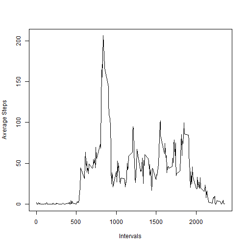
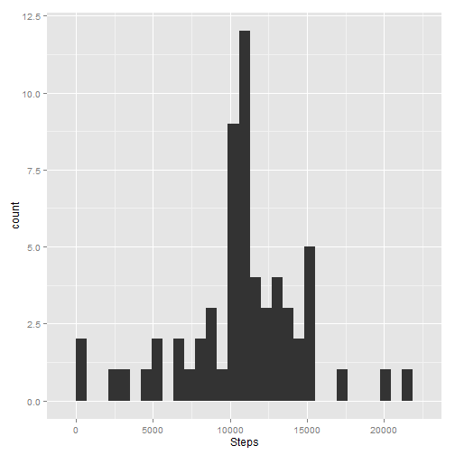
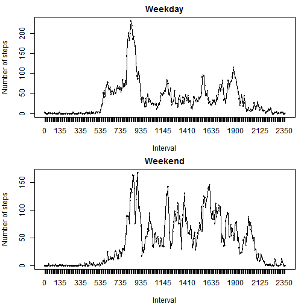

Markdown File for Peer Assessment Assignment

------------------

First, we load the data into R after downloading and extracting the CSV data file into our working directory from the respective [link provided on the assignment page][1]. The name of the file by default is set as "activity.csv". Once we assign the data into a variable, we convert the column representing the date into the 'date' format, as it is initially imported as 'factor'.


```r
data <- read.csv("activity.csv", header = TRUE)
data$date <- as.Date(data$date)
```

Next we subset the data to exclude the NA values and proceed to generate the required histogram. To do this we create a data frame containing the total steps taken on each day, after selecting only the first two columns of the data excluding NA values.


```r
subdata <- subset(data, steps != "NA")
p1 <- as.data.frame(as.matrix(tapply(subdata$steps, as.factor(subdata$date), sum)))
library(ggplot2)
ggplot(p1, aes(V1)) + geom_histogram() + xlab("Steps")
```

```
## stat_bin: binwidth defaulted to range/30. Use 'binwidth = x' to adjust this.
```

 

```r
mean1 <- mean(p1$V1)
median1 <- median(p1$V1)
```

The mean of the total number of steps taken each day is **1.0766 &times; 10<sup>4</sup>** and the median is **10765**.

Next we average the number of steps taken in each 5 minute interval across all days and plot the same.


```r
p2 <- data.frame(unique(subdata$interval), tapply(subdata$steps, as.factor(subdata$interval), mean))
colnames(p2) <- c("interval", "meanSteps")
plot(p2$interval, p2$meanSteps, xlab = "Intervals", ylab = "Average Steps", type = "l")
```

 

```r
m <- as.integer(p2[which.max(p2$meanSteps), "interval"])
max1 <- sprintf("%04d", m)
max2 <- sprintf("%04d", m+4)
```

The interval with the maximum value of average number of steps is **0835 Hrs to 0839 Hrs.**

Next we replace the NA values in the 'steps' column of our original dataset with the mean number steps corresponding to its interval as the values are already calculated and existing in a data frame.


```r
for(i in 1:nrow(data)) {
  if (is.na(data$steps[i]) == TRUE) data$steps[i] <- p2$meanSteps[which(p2$interval == data$interval[i])]
}

p3 <- as.data.frame(as.matrix(tapply(data$steps, as.factor(data$date), sum)))
library(ggplot2)
ggplot(p3, aes(V1)) + geom_histogram() + xlab("Steps")
```

```
## stat_bin: binwidth defaulted to range/30. Use 'binwidth = x' to adjust this.
```

 

```r
mean2 <- mean(p3$V1)
median2 <- median(p3$V1)
```

The modified mean of the total number of steps taken each day is **1.0766 &times; 10<sup>4</sup>** and the modified median is **1.0766 &times; 10<sup>4</sup>**. We see that the value of the mean remains the same from when NA values where omitted from our calculations, but the median value increases slightly to coincide with the mean.

Also, the total daily number of steps will increase as replacement of NA values brings in new values into the calculation of the sum, thereby increasing the value of the number of steps taken each day.

We now proceed to identify if each of the date specified in data falls on a weekday or a weekend, and represent this day type by the variable 'day'. We the average the number of steps taken in each 5 minute interval across these day types and plot the same.


```r
data$day <- weekdays(data$date)
for(i in 1:nrow(data)) {
  if (data$day[i] == "Saturday") data$day[i] <- "weekend"
  else if (data$day[i] == "Sunday") data$day[i] <- "weekend"
  else data$day[i] <- "weekday"
}
data$day <- as.factor(data$day)

sd1 <- split(data, data$day)[[1]]
sd2 <- split(data, data$day)[[2]]

p4_1 <- data.frame(unique(sd1$interval), tapply(sd1$steps, as.factor(sd1$interval), mean), c(rep("weekday", length(unique(sd1$interval)))))
colnames(p4_1) <- c("interval", "meanSteps", "day")
p4_2 <- data.frame(unique(sd2$interval), tapply(sd2$steps, as.factor(sd2$interval), mean), c(rep("weekend", length(unique(sd2$interval)))))
colnames(p4_2) <- c("interval", "meanSteps", "day")                   
p4_1$interval <- as.factor(p4_1$interval)
p4_2$interval <- as.factor(p4_2$interval)

par(mfrow = c(2, 1), mar = c(4, 4, 2, 1))
plot(p4_1$interval, p4_1$meanSteps, main = "Weekday", xlab = "Interval", ylab = "Number of steps", type = "n", asp = 0.5)
lines(p4_1$interval, p4_1$meanSteps)
plot(p4_2$interval, p4_2$meanSteps, main = "Weekend", xlab = "Interval", ylab = "Number of steps", type = "n", asp = 0.5)
lines(p4_2$interval, p4_2$meanSteps)
```

 

[1]: https://d396qusza40orc.cloudfront.net/repdata%2Fdata%2Factivity.zip "link provided on the assignment page"
